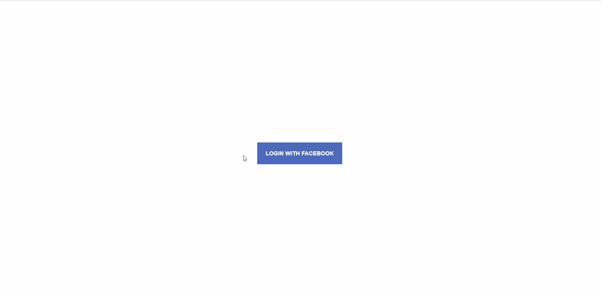

# CoderSchool FTW - * Tic Tac Toe *

Created with love by: Huynh Te Hoa (Leon)
  
This is a simple Canvas-based game that requires a solid understanding of the principles of JavaScript programming to customize. 

## [Gif Walkthrough]

Here's a walkthrough of implemented user stories.

## Required User Stories
- [x] Tic Tac Toe with time travel features
- [x] Tic Tac Toe with high scores

## Time Spent and Lessons Learned

Time spent: **10** hours spent in total.

Describe any challenges encountered while building the app.

## License

    Copyright [2019] [Huynh Te Hoa]

    Licensed under the Apache License, Version 2.0 (the "License");
    you may not use this file except in compliance with the License.
    You may obtain a copy of the License at

        http://www.apache.org/licenses/LICENSE-2.0

    Unless required by applicable law or agreed to in writing, software
    distributed under the License is distributed on an "AS IS" BASIS,
    WITHOUT WARRANTIES OR CONDITIONS OF ANY KIND, either express or implied.
    See the License for the specific language governing permissions and
    limitations under the License.